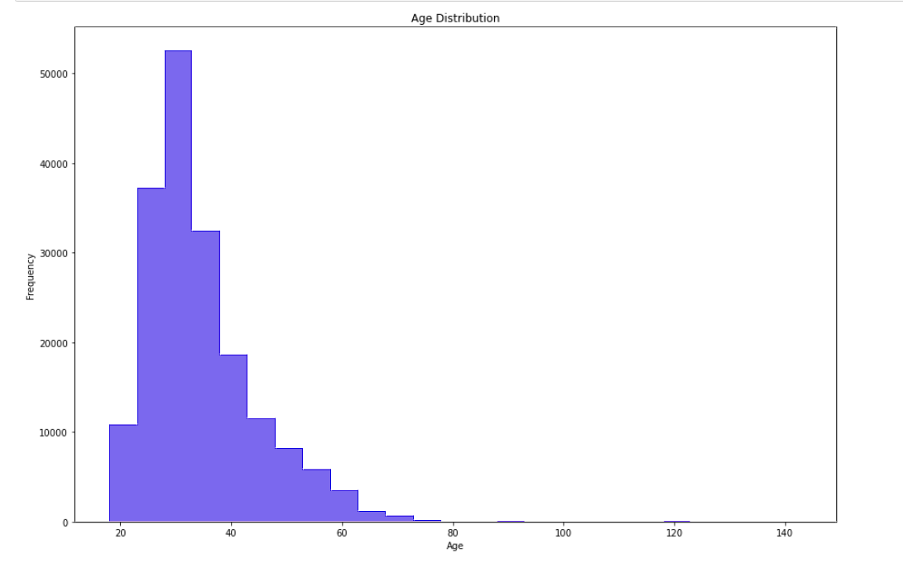
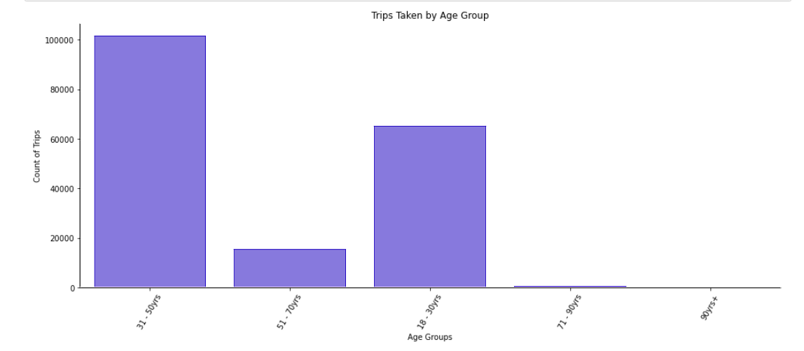
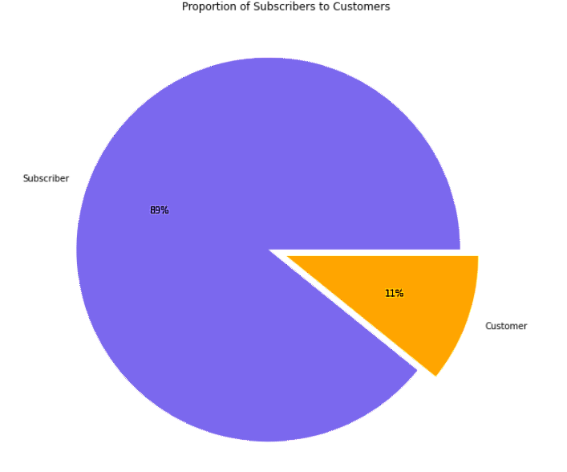

# Ford GoBike System Data
___

___
## INTRODUCTION
___
This data set includes information about individual rides made in a bike-sharing system covering the greater San Francisco Bay area and represents trips taken by members of the service for month of February of 2019. This project helped improved my data assesment & data cleaning skills as I did and **Exploratory Data Analysis** of the dataset.

### PROBLEM STATEMENT
The Ford GoBike organization would love to know if there is a relationship between age & number of subscribers/trips. So I would use the dataset to answer the following question;
* The number of trips taken by age group.
* The proportion of Subscribers to Customers.
* The number of subscribers compared to customers for each age group.
* The trend of trips taken over the month. 
___
## DATA SOURCING
This data set is taken from; [Ford GoBike System Data](https://www.fordgobike.com/system-data).
___
## DATA TRANSFORMATION & DATA CLEANING PROCESS
___
After loading the dataset I took the following steps in my wrangling/cleaning process:
* I started by assessing the data visually & programmatically.
* I created a copy of the dataset before cleaning.
* I noticed issues with data types where multiple columns were formatted as the wrong data types which I re-formatted properly.
* I also spotted columns with missing values which I filled appropriately and the ones I couldnt fill I dropped them.
* I dropped the columns that were not neccesary for my analysis.
* I also did feature engineering to add some columns/features that would be helpful fot my analysis.
* After wrangling/cleaning of the data I moved on to the following data explorarion:
    * Univariate Exploration.
    * Bivariate Exploration.
    * Multivariate Exploration.  
The above summarises my data wrangling and analytics process for this project.
___
## SKILLS DEMONSTRATED
___
For this project I did my data cleaning and visualizations all in Python using complex functions such as;
* ___LIBRARIES USED___

* ___FILL MISSING VALUES___

* ___FEATURE ENGINEERING___

___
## ANALYSIS & VISUALIZATIONS
___
### SUMMARY
After using Univariate, Bivariate & Multivariate exploration to check my variables of interest, this is the summary of my findings:
* I discovered that younger people between **18-50** years old take more trips and even subscribe more.
#### Age Distribution

#### Number of Trips Taken by Age Group

* Majority of the people that take trips are just Customers.
#### Proportion of Customers to Subscribers

* Majority of trips were taken **5PM** & **8AM** but then I also noticed that the longest trips were taken **3AM** & **2AM**.
* Male takes more trips but they appear to be for shorter distance/duration.
* **Thursday** & **Tuesday** came out as the days that most trips were taken, I thought it would be on weekends though.
* Number of trips start declining after the 3rd week of the month.

## Key Insights for Presentation
For the presentaion I'll like to focus on how age affects the number of trips and even the number of people that subscribe to the Bike share program. I'll start by introducing the age variable and then show how it is distributed accross the dataset.

After which I introduce how the diffrent age groups come out on:
    * The number of trips taken using a simple bar chart
    * The proportion of Subscribers to Customers using a simple pie chart
    * The number of subscribers compared to customers for each age group using a simple clustered bar chart for easy comparison.
    * The trend of trips taken over the month using a line plot.
    
    
* When are most trips taken in terms of time of day & day of the week?

* How long does the average trip take & Does it depend on if a user is a subscriber or customer?

* Does a particular age group take more trips?

* Does a particular age group subscribe more?

* Is there a particular time an age group take trips?

* Do trips taken in a particular time of day last longer?

* Does a particular gender take more trips?

* Does a particular gender subscribe more than the other?

* Is there a relationship between **trip_time** and duration of trips?

* Does **age** affect the duration of trips?

* Does **gender** affect the trip duration?

* What is the trend of trips over the weeks for: **user_type**, **member_gender** & **age_group**?
